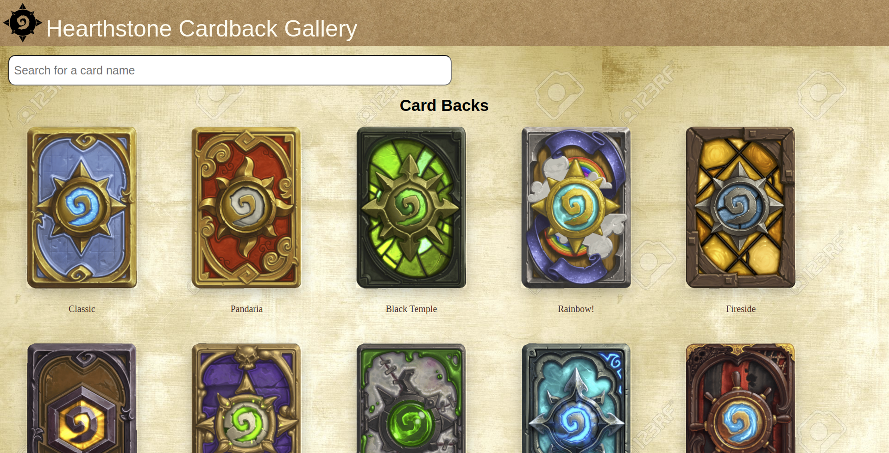

# Hearthstone Cardback Gallery
> Cardback display gallery


Simply uses the hearthstone API to map and display every cardback from hearhtstone, with search capability.



## Installation


1 - create a .env file within /api and create an API_KEY variable with a key from https://rapidapi.com/omgvamp/api/hearthstone

2 - /api
```sh
npm install && npm start
```

3 - /client
```sh
npm install && npm start
```

## Release History

* 0.0.1
    * Work in progress
    * Homepage displayings all cardbacks, search functionality. No other routes
